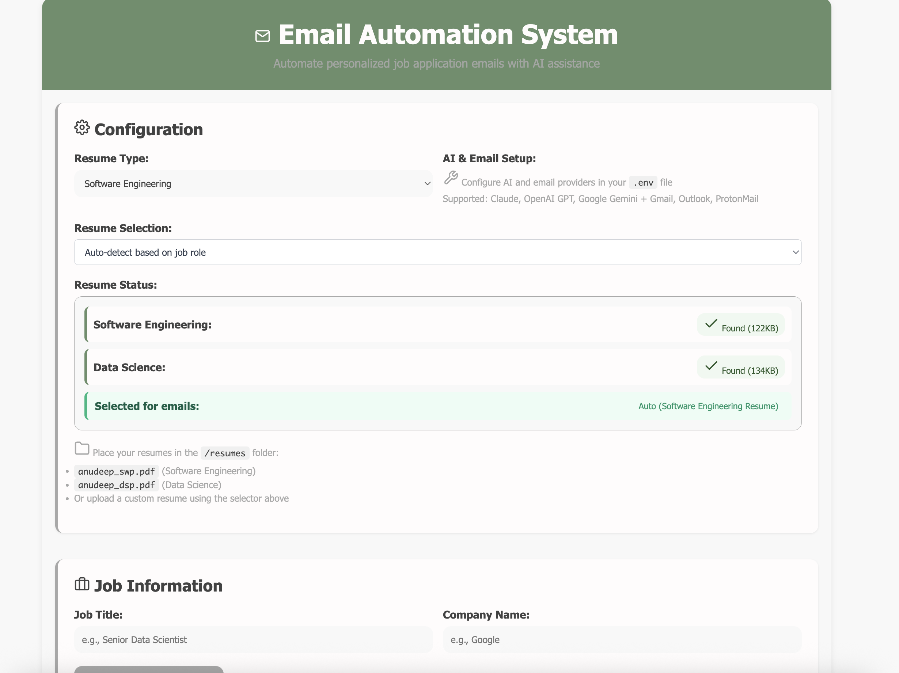
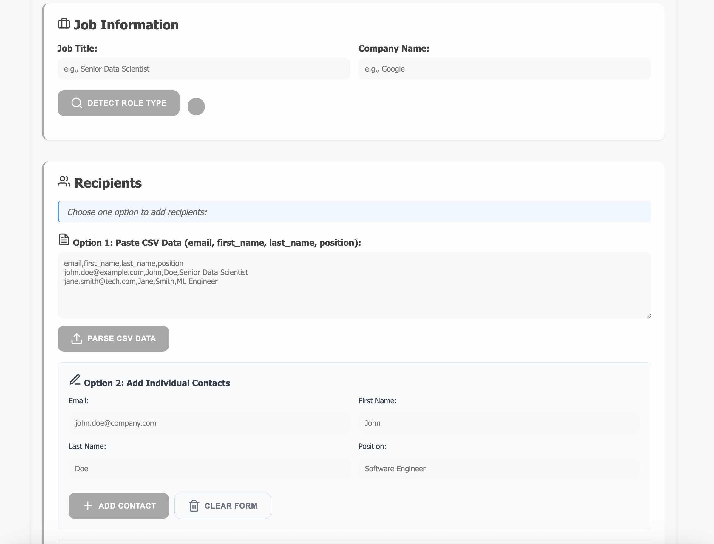
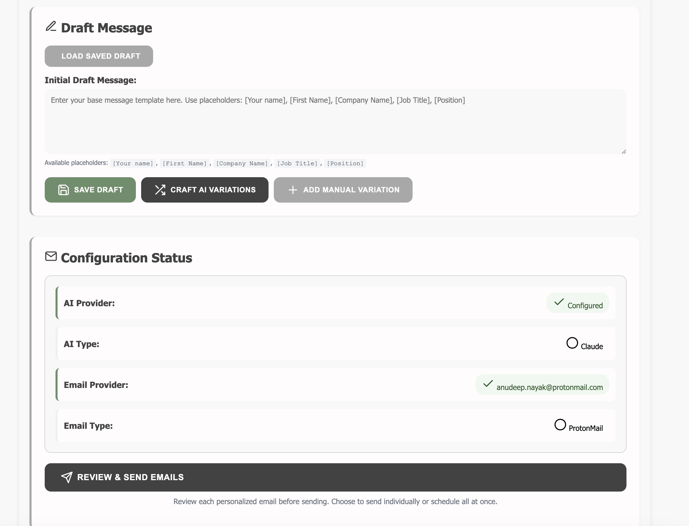

# Email Automation System

An intelligent email automation tool for job applications powered by AI. This system streamlines the process of sending personalized job application emails by leveraging AI models (Claude, OpenAI GPT, or Google Gemini) to generate tailored content and automatically managing email delivery through popular email providers.

## Screenshots







## Features

**AI-Powered Content Generation**
- Intelligent email template generation using Claude API, OpenAI GPT, or Google Gemini
- Smart role detection for Software Engineering, Data Science, and Data Analyst positions
- Context-aware personalization based on job descriptions and recipient information

**Multi-Provider Support**
- **Email Providers**: Gmail, Outlook, ProtonMail
- **AI Models**: Claude (Anthropic), OpenAI GPT, Google Gemini
- Seamless switching between providers through configuration

**Automation & Efficiency**
- Template caching and reuse for similar job types
- Bulk processing via CSV file upload
- Draft creation in your email provider of choice
- Responsive web interface for easy management

**Smart Features**
- Automatic role type detection from job descriptions
- Template similarity matching to avoid regeneration
- Rate limiting to respect email provider limits
- Comprehensive error handling and logging

## Prerequisites

- Node.js (v14 or higher)
- npm or yarn package manager
- API key from your chosen AI provider
- App-specific password for your email provider

## Quick Start

1. **Clone and Setup**
   ```bash
   git clone <repository-url>
   cd email-automation-system
   ./setup.sh
   ```

2. **Configure Environment**
   Edit the `.env` file with your credentials:
   ```bash
   nano .env
   ```

3. **Launch Application**
   ```bash
   ./launch.sh
   ```

4. **Access Application**
   Open your browser to `http://localhost:3000`

## Configuration

### AI Provider Setup

**Option 1: Claude (Anthropic)**
```env
AI_PROVIDER=claude
CLAUDE_API_KEY=your_claude_api_key_here
```
Get your API key at: https://console.anthropic.com/

**Option 2: OpenAI GPT**
```env
AI_PROVIDER=openai
OPENAI_API_KEY=your_openai_api_key_here
```
Get your API key at: https://platform.openai.com/

**Option 3: Google Gemini**
```env
AI_PROVIDER=gemini
GEMINI_API_KEY=your_gemini_api_key_here
```
Get your API key at: https://makersuite.google.com/

### Email Provider Setup

**Gmail Configuration**
1. Enable 2-Factor Authentication
2. Generate App Password: Google Account → Security → App Passwords
3. Configure in `.env`:
   ```env
   EMAIL_PROVIDER=gmail
   EMAIL_ADDRESS=your@gmail.com
   EMAIL_APP_PASSWORD=your_app_password
   ```

**Outlook Configuration**
1. Enable 2-Factor Authentication
2. Generate App Password in Microsoft Account Security
3. Configure in `.env`:
   ```env
   EMAIL_PROVIDER=outlook
   EMAIL_ADDRESS=your@outlook.com
   EMAIL_APP_PASSWORD=your_app_password
   ```

**ProtonMail Configuration**
1. Enable 2-Factor Authentication
2. Generate App Password: Settings → Security → App passwords
3. Configure in `.env`:
   ```env
   EMAIL_PROVIDER=protonmail
   EMAIL_ADDRESS=your@protonmail.com
   EMAIL_APP_PASSWORD=your_app_password
   ```

## Usage Guide

### 1. Application Configuration
- Select your AI provider and email provider
- Upload your resume PDF (supports multiple versions)
- Configure email signature and preferences

### 2. Job Application Process
- **Job Details**: Enter job title, company name, and paste job description
- **Role Detection**: Click "Detect Role Type" for automatic categorization
- **Template Generation**: Generate AI-powered, personalized email templates
- **Template Management**: Save and reuse templates for similar positions

### 3. Bulk Processing
- **CSV Upload**: Upload recipient list with required columns
- **Preview**: Review recipients and generated emails before sending
- **Draft Creation**: Generate drafts in your email provider
- **Manual Review**: Review and customize drafts before sending

### CSV File Format

Your CSV file must include these columns:

```csv
email,first_name,last_name,position
john.doe@example.com,John,Doe,Senior Data Scientist
jane.smith@techcorp.com,Jane,Smith,Machine Learning Engineer
bob.johnson@startup.io,Bob,Johnson,Full Stack Developer
alice.brown@company.com,Alice,Brown,Data Analyst
```

**Required Columns:**
- `email`: Recipient's email address
- `first_name`: First name for personalization
- `last_name`: Last name for personalization  
- `position`: Job title or position

## Advanced Features

### Template Caching
The system automatically caches email templates based on job keywords and role types. Similar job applications will reuse existing templates, saving API calls and ensuring consistency.

### Rate Limiting
Built-in rate limiting respects email provider restrictions:
- Gmail: 500 emails/day
- Outlook: 300 emails/day  
- ProtonMail: 150 emails/day

### Error Handling
Comprehensive error handling for:
- Invalid API keys
- Email authentication failures
- Network connectivity issues
- Malformed CSV files
- Rate limit exceeded scenarios

## File Structure

```
email-automation-system/
├── server.js              # Main server application
├── index.html             # Web interface
├── script.js              # Frontend JavaScript
├── styles.css             # Styling
├── setup.sh               # Installation script
├── launch.sh              # Launch script
├── .env.example           # Environment template
├── sample-recipients.csv  # Example CSV format
├── uploads/               # Resume storage
├── templates/             # Email template cache
└── drafts/                # Generated draft storage
```

## Troubleshooting

### Common Issues

**API Authentication Errors**
- Verify API key is correct and has sufficient credits
- Check that the API provider is properly selected in `.env`

**Email Delivery Issues**
- Confirm app-specific password is generated and correct
- Verify 2FA is enabled on your email account
- Check email provider settings match configuration

**CSV Processing Errors**
- Ensure CSV headers exactly match required format
- Check for special characters or encoding issues
- Verify email addresses are valid format

**Application Won't Start**
- Confirm Node.js is installed (`node --version`)
- Run `npm install` to install dependencies
- Check port 3000 is available

### Debug Mode

Enable detailed logging by setting:
```env
NODE_ENV=development
```

Check `server.log` for detailed error information.

## Contributing

1. Fork the repository
2. Create a feature branch (`git checkout -b feature/amazing-feature`)
3. Commit your changes (`git commit -m 'Add amazing feature'`)
4. Push to the branch (`git push origin feature/amazing-feature`)
5. Open a Pull Request

## License

This project is licensed under the MIT License - see the [LICENSE](LICENSE) file for details.

## Support

If you find this project helpful, please consider:

⭐ **Star this repository** to help others discover it

☕ **[Buy me a coffee](https://buymeacoffee.com/anudeepnayak)** to support continued development

---

**Disclaimer**: This tool is for legitimate job application purposes only. Please respect email provider terms of service and recipient privacy. Always review generated content before sending.